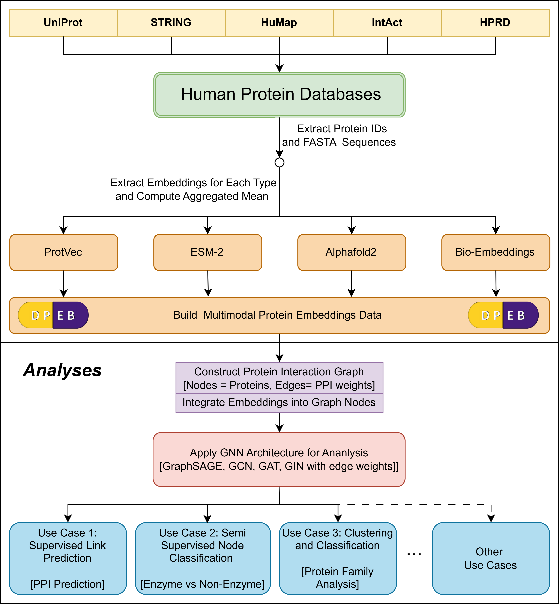

# DeepDrug Protein Embeddings Bank (DPEB) : A Multimodal Human Protein Embeddings Data

<p align="center">
  
</p>
Protein-protein interactions (PPIs) are fundamental to biological processes, yet researchers face significant challenges
in computational PPI prediction due to the lack of integrated, multimodal protein representations. We present DPEB,
the first searchable database focused exclusively on human proteins that integrates four distinct protein embedding
types—capturing complementary biological modalities from sequence to structure. DPEB combines structurally-informed
features (AlphaFold2 [18]), transformer-based sequence embeddings (BioEmbeddings [8]), contextual amino acid patterns
(ESM-2: Evolutionary Scale Modeling [23]), and sequence-based n-gram statistics (ProtVec [3]) to provide comprehensive
protein characterizations. While protein structures predicted by AlphaFold2 are broadly available through repositories
such as the AlphaFold Protein Structure Database, access to the internal neural network embeddings generated by
AlphaFold2—particularly in a format suitable for downstream computational modeling—remains extremely limited. To
address this gap, DPEB provides, to our knowledge, the first large-scale, human-specific collection of AlphaFold2-derived
embeddings in a publicly accessible format, specifically designed for incorporation into predictive modeling framework with
other types of embeddings. Our benchmark evaluations demonstrate that GraphSAGE models utilizing BioEmbedding
representations achieve the highest performance (87.37% AUROC, 79.16% accuracy) for PPI prediction tasks, while our
framework correctly categorizes proteins into enzyme/non-enzyme classes with 77.42% accuracy and achieves 86.04%
accuracy for protein family classification. By making these diverse embeddings accessible through a unified framework
that supports multiple graph neural network architectures, DPEB accelerates research in systems biology, drug discovery,
and personalized medicine through more powerful protein interaction modeling.

This repository provides the environment setup used in our experiments related to deep protein embeddings, graph neural networks, and AlphaFold-based representations.

---
## Our Contribution
We present DPEB, the first searchable database exclusively
focused on 22,043 human proteins that integrates four
distinct protein embedding types—each capturing a unique
biological modality including sequences up to 1,975 amino
acids. This novel resource combines representations of
structurally-informed features (AlphaFold2 [18]), transformer-
based sequence embeddings (BioEmbeddings [8]), contextual
amino acid patterns (ESM-2: Evolutionary Scale Modeling
[23]), and sequence-based n-gram statistics (ProtVec [3]),
which altogether provide a multi-dimensional characterization
of human proteins. By incorporating these complementary
embedding approaches, our database captures protein
properties at multiple biological levels—from primary sequence
patterns to tertiary structural features—enabling a more
holistic analysis than any single embedding method could
achieve.
The novelty of DPEB extends beyond its human-
specific focus and multimodal embeddings. Our platform
uniquely enables researchers to cross-reference predictions
across different embedding types, revealing insights that
might be missed when using a single representation
strategy. The observed variation in predictive accuracy
across embedding types suggests that each representation
captures distinct and complementary aspects of protein
function, structure, or sequence—a key advantage for modeling
complex biological systems. For example, BioEmbedding
achieved the highest AUROC (87.37%) in our experiments,
while AlphaFold2 captured interactions potentially driven
by structural similarity. These findings reveal that no
single embedding type captures the full spectrum of protein
properties, establishing that multimodal integration is essential
rather than optional for comprehensive interactome modeling.
Unlike existing databases that lack species specificity or
utilize limited embedding approaches, DPEB distinctively
combines human-specific data from multiple established
repositories, including UniProt [7], STRING [33], and
IntAct [28] with our novel multimodal embedding framework.
This comprehensive protein interaction resource integrates
structural, sequential, evolutionary, and functional properties
within a unified analysis platform.
Our database supports multiple graph-based neural network
architectures, including GraphSage, Graph Convolutional
Networks (GCNs), Graph Transformer Networks (GTNs),
Graph Neural Networks (GNNs), and Graph Isomorphism
Networks (GINs). This flexibility enables researchers to apply
the most appropriate model for specific biological questions,
further enhancing the utility and adaptability of our platform
for diverse research needs in computational biology.
By providing researchers with this innovative, human-
focused resource that leverages the complementary strengths of
four distinct embedding approaches, DPEB aims to accelerate
research in systems biology, drug discovery, and personalized
medicine through more accurate and comprehensive protein
interaction predictions than previously possible.

--- 
##  Dataset Acesss

The dataset can be accessed from this [Box link](https://lsu.box.com/s/klwmn28k7hf8s048ebervd4v8y9i0zli).

The data repository contains three main subdirectories under the `embeddings/` directory, each corresponding to a different protein embedding type:

The repository is organized under the `embeddings/` directory with subfolders for each protein embedding type. Each folder includes:

- A `.rar` archive containing individual `.npy` embedding files
- A `.csv` metadata file with UniProt IDs, protein sequences, or pre-aggregated embeddings

```text
embeddings/
├── AlphaFold/
│   ├── All_ePPI_Alphafold2_Embeddings_np_v1.3.rar
│   │   ├── Q9Y6X2.npy
│   │   ├── P12345.npy
│   │   └── ...
│   ├── eppi_alphafold_aggregated_embeddings.csv
│   └── ...
├── ESMFold/
│   ├── esm2_dict_embeddings.rar
│   │   ├── Q9Y6X2.npy
│   │   ├── P12345.npy
│   │   └── ...
│   ├── ProteinID_proteinSEQ_ESM_emb.csv
│   └── ...
├── ProtVec/
│   ├── protvec_dict_embeddings.rar
│   │   ├── Q9Y6X2.npy
│   │   ├── P12345.npy
│   │   └── ...
│   ├── protvec_embeddings_eppi.csv
│   └── ...
└── BioEmbeddings/
    ├── bioemb_dict_embeddings.rar
    │   ├── Q9Y6X2.npy
    │   ├── P12345.npy
    │   └── ...
    ├── bioembeddings_metadata.csv
    └── ...

```
Each `.npy` file inside the `.rar` archive corresponds to a protein and contains its embedding matrix or vector:

- **AlphaFold2**: `[L × 384]` structure-informed residue embeddings
- **ESMFold**: `[L × 1280]` or `[L × 2560]` contextualized transformer embeddings
- **ProtVec**: `[100]` pooled trigram-based sequence vector
- **BioEmbeddings**: `[L × 1024]` embeddings from language models like SeqVec or ProtBert

The `.csv` metadata files contain UniProt IDs, amino acid sequences, and optionally precomputed averaged embeddings for fast access.

These files are ready to be used in:
- GNN-based protein–protein interaction (PPI) prediction
- Protein classification
- Protein family clustering
- Any downstream computational biology pipeline

---
##  Environment Setup

To reproduce the results or run any experiments in this repository, use the provided Conda environment file to set up your environment. The environment is named `DPEB` and includes dependencies such as PyTorch, DGL (CUDA 10.2), scikit-learn, transformers, and AlphaFold-related utilities.

###  Prerequisites

- [Anaconda](https://www.anaconda.com/products/distribution) or [Miniconda](https://docs.conda.io/en/latest/miniconda.html)
- CUDA 10.2-compatible GPU (for using GPU-based operations via PyTorch + DGL)

---

###  Create the Environment

You can recreate the `DPEB` environment using the provided `env.yml` file:

```bash
conda env create -f /home/saiful/DPEB/env.yml
```

###   Activate the Environment
```bash
conda activate DPEB
```

 Usage Notes
After activating the environment, you're ready to:

Run AlphaFold embedding scripts

Use DGL-based GNNs for protein-protein interaction prediction

Load and analyze protein sequence datasets

Train transformer-based or hybrid models for biological tasks

## Loading and Understanding `.npy` Embedding Files

Each `.npy` file inside the `.rar` archive contains the embedding and metadata for a single protein, stored as a Python dictionary. These files can be loaded and inspected using NumPy:

### Example: Loading a Protein Embedding

```python
import numpy as np

# Path to an example AlphaFold embedding file
file_path = "/data/saiful/ePPI/alphafold_eppi_embeddings/All_ePPI_Alphafold2_Embeddings_np_v1.3/X6RFL8_embedding.npy"

# Load the file (set allow_pickle=True to load Python objects)
embedding = np.load(file_path, allow_pickle=True)

# The stored object is a Python dictionary, so extract it using .item()
content = embedding.item()

# Inspect the structure
print("Extracted object type:", type(content))
print("Protein ID:", content['protein_id'])
print("FASTA sequence:", content['fasta'][:60], "...")  # Preview the sequence
print("Embedding shape:", content['embedding'].shape)

```

### Structure of Each `.npy` File

Each file contains a Python dictionary with the following keys:

- **`protein_id`**: A UniProt-style identifier for the protein  
  _Example_: `"X6RFL8"`

- **`fasta`**: The amino acid sequence of the protein in FASTA format  
  _Example_: `"MATAPYNYSYIFKYIIIGDMGVGKSCLLHQFTEKKFMADCPHTI..."`

- **`embedding`**: A NumPy array of shape `[L × D]` where:  
  - `L` is the number of amino acids (i.e., the length of the protein)  
  - `D` is the embedding dimension  
    - _Examples_: `384` for AlphaFold2, `1024` for BioEmbeddings, etc.

This array contains **per-residue embeddings** suitable for structural or sequence-based modeling tasks such as classification or graph-based learning.

---

### Example Output

<pre lang="md"> ```text Extracted object type: <class 'dict'> Protein ID: X6RFL8 FASTA sequence: MATAPYNYSYIFKYIIIGDMGVGKSCLLHQFTEKKFMADCPHTIGVEFGT ... Embedding shape: (228, 384) ``` </pre>


---

### Use Cases

These embeddings can be directly used as input features for deep learning models in tasks like:

- Graph-based **protein–protein interaction prediction**
- **Enzyme vs. non-enzyme classification**
- **Protein function** and **family clustering**


